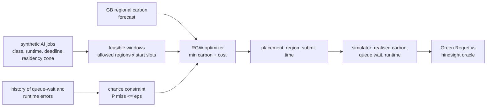

# CARBON ORACLE

**Risk-bounded carbon, cost and deadline scheduling for delay-tolerant AI jobs across regions.**

Batch inference, embedding backfills, eval suites and fine-tuning jobs can often wait, or run somewhere
else, to use cleaner electricity. The usual carbon-aware scheduler picks the (region, start time) with
the lowest *forecast* carbon that still fits the deadline *if every estimate is right*. Queue waits and
runtimes are not always right, so the plan that waits until the last feasible clean window misses its
deadline. CARBON ORACLE's **Risk-Bounded Green Window (RGW)** keeps the same objective but only accepts
placements whose probability of missing the deadline is at most `eps`. The probability comes from the
empirical history of queue-wait and runtime errors. Data residency is a hard filter. Everything is
scored with **Green Regret**: the normalised carbon + cost gap to a hindsight oracle, plus a fixed
penalty for every deadline miss or residency violation.

> v0.1 research prototype, offline, no cloud account. Carbon intensity is **real** (3 weeks of GB
> regional data, cached). Jobs, prices, queue waits and runtime errors are **synthetic**. The regions
> are **illustrative**: hypothetical cloud regions placed in GB grid regions. No cloud provider is implied.



## Evidence

From [`reports/benchmark.md`](reports/benchmark.md): 24 scenarios x 50 jobs. The 16 **nominal**
scenarios (800 jobs) draw queue waits and runtimes from the same distribution as the schedulers'
history. Lower Green Regret is better.

| Policy (nominal, 800 jobs) | Green Regret / job | Deadline misses | Carbon vs run-now |
|---|---|---|---|
| Run immediately, home region | 1.233 | 0/800 (0.0%) | +0.0% |
| Carbon-agnostic cheapest | 1.232 | 0/800 (0.0%) | +3.4% |
| Deadline-first (shortest forecast queue) | 1.232 | 0/800 (0.0%) | +3.4% |
| Lowest-carbon-now | 0.442 | 4/800 (0.5%) | -53.5% |
| Best window, home region (carbon-aware-sdk style) | 2.637 | 159/800 (19.9%) | -38.2% |
| Deterministic forecast optimizer (= RGW without the chance constraint: the ablation) | 1.300 | 101/800 (12.6%) | -78.7% |
| Deterministic + hand-tuned padding (2x queue, +25% runtime) | 0.451 | 31/800 (3.9%) | -77.5% |
| RGW, eps = 0.20 | 0.501 | 36/800 (4.5%) | -77.8% |
| RGW, eps = 0.01 | 0.243 | 5/800 (0.6%) | -71.1% |
| **RGW, eps = 0.05** | **0.189** | **8/800 (1.0%)** | -75.6% |

- **What the risk bound costs.** Removing the chance constraint (the ablation) cuts deadline misses
  from 12.6% to 1.0% but RGW uses **+14.9%** more carbon than the ablation. With a miss penalty of 10
  (1.0 = a job's entire reference carbon, or its entire reference cost) that trade is worth it. If misses
  were cheap, padding or eps = 0.20 would score better.
- **By construction:** on the nominal scenarios the history and the realised waits come from the same
  generator, so the miss rate staying under `eps` is expected, not discovered. What is measured is the
  carbon price of the bound and how it compares with the obvious hand-tuned padding (Green Regret 0.189
  vs 0.451, carbon -75.6% vs -77.5%).
- **Negative case: calm queues** (4 scenarios, queues and runtimes better than history). The bound
  reserves slack nobody needed. Here RGW (0.064) loses to hand padding (0.042) and to RGW with
  eps = 0.20 (0.035), and uses +21.6% carbon vs the ablation. In `calm-d01` the deterministic optimizer
  got lucky: 0 misses, and RGW used **+29.7%** more carbon for the same 0 misses.
- **Failure case: tail shift** (4 scenarios, wider errors and 10% congestion events not seen in
  history). The bound is miscalibrated: RGW misses **10.5%** of deadlines against a promised 5%. That is
  still better than the ablation (17.0%) and about the same as padding (11.0%). A chance constraint is
  only as good as the history it was calibrated on.
- **Residency:** 0 violations for every policy, **by construction**: residency is a filter applied
  before optimisation, not a trade-off.
- Carbon forecast error is real: the realised intensity is 0.792x (p5) / 1.034x (p50) / 1.649x (p95)
  of what every policy saw. The oracle knew it, so it counts toward everyone's regret.

Carbon-agnostic cheapest and deadline-first coincide here because the synthetic assumptions make the
largest region both the cheapest and the one with the shortest queue.

## Quickstart

Needs Python 3.10+. No runtime dependencies. pytest is only needed for the tests.

```bash
python -m venv .venv && . .venv/bin/activate       # Windows: .venv\Scripts\activate
python -m pip install "pytest>=8"
python -m pytest -q
python -m carbon_oracle bench --out reports      # all 24 scenarios, about 10 s, offline
python -m carbon_oracle.fetch --start 2026-09-01 --days 21   # optional: refresh the cached trace (network)
```

## How it works

- **Data** ([`data/`](data/)): GB Carbon Intensity API (NESO), CC BY 4.0, keyless. The cache holds 21 days
  (2026-09-01 to 2026-09-21, 1008 half-hours) of national forecast + actual and regional forecast for 7
  grid regions. It is fetched on 2026-09-29; source, license, window and SHA-256 are in
  `data/gb_carbon_intensity.meta.json`. The API publishes no regional actuals, so realised regional
  intensity = regional forecast x the same half-hour's national actual/forecast ratio. The error is real
  but common to all regions (see limitations).
- **Regions** ([`carbon_oracle/data.py`](carbon_oracle/data.py)): 5 in England, 2 in Wales. Residency zones
  are `england`, `wales`, `gb` (any) and `pinned` (home region only). Scottish grid regions are left
  out: the API reports about 0 gCO2/kWh for them throughout the window, which would make them trivially
  optimal.
- **Jobs and world** ([`carbon_oracle/model.py`](carbon_oracle/model.py), synthetic): four job classes with
  their own runtime range, runtime error, slack and node power. Each region has a list price and a queue
  wait that doubles in working hours and has a lognormal error with occasional 3-6x congestion events.
  The key assumption: **the low-carbon regions are the small, congested ones**. Without that assumption
  there is no carbon-vs-deadline tension to study. Realised values are drawn once per scenario and shared
  by every policy.
- **Objective**: `J = carbon / carbon_ref + cost / cost_ref`. The references are the job's nominal energy
  at 100 gCO2/kWh and its nominal runtime at the mean price, so 1% of cost weighs the same as 1% of
  carbon. **Green Regret** per job = `J_policy - J_oracle + 10 x (missed or residency violation)`.
- **Oracle**: enumerates every allowed (region, half-hour submit slot) with realised carbon, queue wait
  and runtime, and takes the best one that meets the deadline.
- **RGW** ([`carbon_oracle/policies.py`](carbon_oracle/policies.py)): the same enumeration on forecasts. A
  candidate is feasible only if the (1 - eps) empirical quantile of `forecast_wait x queue_error +
  nominal_runtime x runtime_error` fits before the deadline. The errors come from 1000 historical draws
  per region and job class. The deterministic optimizer is the same code with point estimates.
  Placement is final: no re-planning, no preemption.

### Failure taxonomy

| Failure | Who suffers here | Handled by RGW? |
|---|---|---|
| Carbon forecast wrong (common-mode, 0.792x-1.649x p5-p95) | everyone vs the oracle | no: RGW optimises the forecast it gets |
| Queue wait longer than forecast | deterministic, best-window | yes, up to `eps`, if history is representative |
| Runtime longer than estimated | deterministic, best-window | yes, same condition |
| Error distribution shifts worse than history | RGW too (10.5% misses at eps = 0.05) | **no** |
| Errors smaller than history | RGW pays carbon for unused slack | **no** (negative case) |
| Residency zone misconfigured | every policy | no: the mapping is trusted input ([threat model](docs/THREAT_MODEL.md)) |

## Prior art and what is not new

The mechanism is not new. Chance-constrained, uncertainty-aware carbon scheduling is published work:

- *Carbon-Aware Scheduling and Distributionally Robust Optimization for Cloud Systems* (IEEE CloudCom
  2025, [DOI 10.1109/CLOUDCOM67567.2025.11331352](https://doi.org/10.1109/CLOUDCOM67567.2025.11331352)),
  with an extended version in the Journal of Cloud Computing (2026,
  [10.1186/s13677-026-00904-7](https://doi.org/10.1186/s13677-026-00904-7)). It uses distributionally
  robust chance constraints (moment and Wasserstein ambiguity sets) and CVaR on emissions and SLA
  violations for geo-distributed data centres. It is strictly more sophisticated than RGW's empirical
  quantile. A conformal-prediction chance-constrained scheduler for 24/7 carbon-free operation is also
  published ([arXiv 2510.04053](https://arxiv.org/abs/2510.04053)).
- Temporal shifting and its sensitivity to forecast error: *Let's Wait Awhile* (Wiesner et al.,
  Middleware 2021), which also has an open simulator. Cluster-level provisioning and scheduling of
  delay-tolerant jobs: CarbonFlex ([arXiv 2505.18357](https://arxiv.org/abs/2505.18357)) and GAIA
  (Hanafy et al., ASPLOS 2024), which covers the carbon / performance / cost trade-off. Spatial shifting
  for services: CASPER (IGSC 2023). Survey:
  [arXiv 2508.05949](https://arxiv.org/abs/2508.05949).
- Tools: the Green Software Foundation Carbon Aware SDK finds the best forecast window for a location
  and duration, with no risk bound; the `best_window_home` baseline models that query. Azure's
  carbon-aware KEDA operator scales replica limits by carbon intensity thresholds. Neither reasons about
  deadline risk. No mature open-source tool implementing chance-constrained region x time placement
  was found (searched September 2026), so this was built rather than stopped.

What this repository adds is engineering and evidence rather than a new algorithm. It is an open,
offline, reproducible benchmark on real published forecast/actual data, with residency zones and AI job
classes. It compares against the baselines practitioners actually use, including a hand-tuned padding
heuristic that the risk bound only narrowly beats, and it reports where the risk bound loses.

## Limitations

- **Synthetic queues, runtimes and prices drive the result.** The carbon-vs-deadline tension exists
  because low-carbon regions were assumed to be congested. Other assumptions give other rankings.
- **Carbon forecast error is common-mode.** Regional actuals are derived from one national ratio, so the
  error never changes which region is cleanest, only which time. The API does not document the lead
  time of its historical forecasts. It is likely shorter than a day-ahead planner's, so errors are
  probably understated.
- Jobs are independent: placing many jobs in one region does not lengthen its queue. There is no
  capacity coupling, fairness or multi-tenant interference.
- No re-planning or preemption. A deterministic scheduler that re-plans on overrun would miss less.
- Average (not marginal) intensity, one grid, three weeks in September. Data transfer, storage and
  embodied carbon are not counted.
- The objective weights (100 gCO2/kWh reference, cost weight 1, penalty 10) are parameters. Only `eps`
  is swept.
- RGW's realised miss rate (1.0%) sits far below `eps` (5%), probably because many optima are not on
  the constraint boundary. The bound is conservative, not tight.

## Layout

```
carbon_oracle/data.py       cached trace, region -> grid mapping, step-function integrals
carbon_oracle/model.py      synthetic jobs and world, objective, outcome, hindsight oracle
carbon_oracle/policies.py   baselines, deterministic optimizer, padding heuristic, RGW
carbon_oracle/bench.py      scenarios, Green Regret aggregation, Markdown report, provenance
carbon_oracle/fetch.py      the only network code: refreshes data/ from the Carbon Intensity API
data/                       cached GB carbon intensity + source/license/hash metadata
reports/                    generated evidence (JSON + Markdown)
```

Deliberately absent in v0.1: cloud adapters, Kubernetes, OpenTelemetry, Terraform, identity. The thesis
can be tested offline, and none of those would change a number here.

## Next (v0.2)

Kubernetes queue controller or scheduler extender, capacity coupling between jobs, re-planning on
overrun, online recalibration of the error history (the tail-shift fix), a second grid with real
regional actuals, and a CI benchmark matrix over the objective weights.

Data: Carbon Intensity API, National Energy System Operator, CC BY 4.0. Code: MIT licensed.
